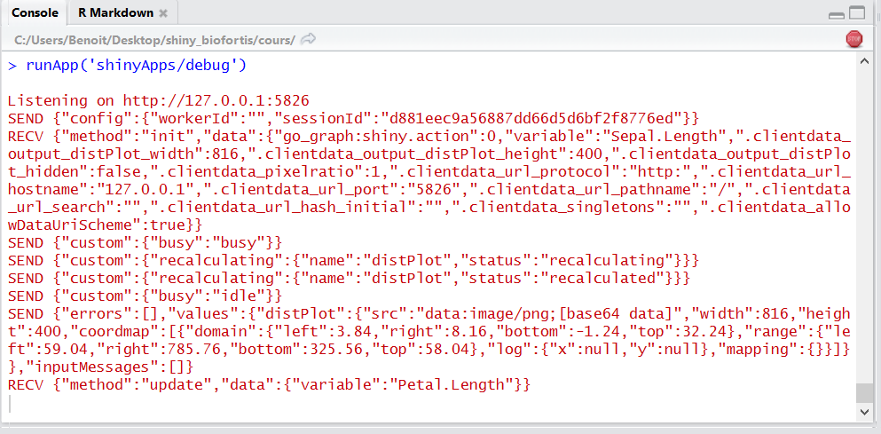
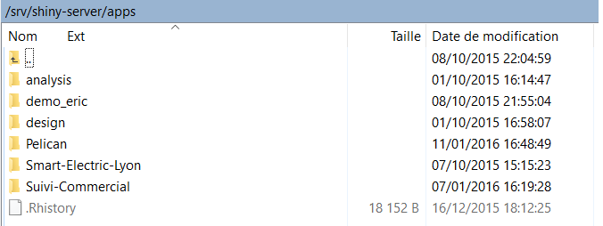
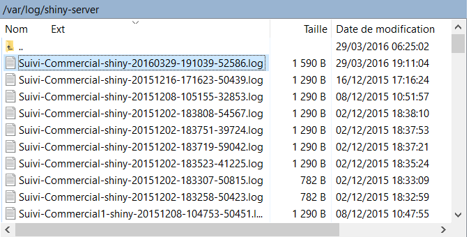

# Shiny : créer des applications web avec le logiciel R

Shiny \citep{shiny} est un package qui permet la création simple d'applications web intéractives depuis le logiciel open-source __R__. Il présente quelques intérêts non négligeables qui ont participé à son succès [^fn_shiny]:

- il ne nécessite pas de connaissances _web_;
- les applicatonsse reposent sur la puissance de calcul **R**;
- il permet de développer des applications intéractives inspirées du web actuel;
- il permet de créer des applications locales ou partagées avec l'utilisation d'un _\og shiny-server\fg{}_ [^fn_server].

Une application __shiny__ nécessite un ordinateur/un serveur exécutant une session __R__ (cf. figure~\ref{schema_principe}, page~\pageref{schema_principe})


[^fn_shiny]: Plus de détails sur __shiny__ à l'adresse <http://shiny.rstudio.com>.
[^fn_server]: Plus de détails sur l'utilisation de __shiny-server__ à l'adresse <https://www.rstudio.com/products/shiny/shiny-server>.


\section{Première application avec shiny}

Initialiser une application est simple avec **RStudio** \citep{rstudio}, en créant un nouveau projet: _File > New Project > New Directory > Shiny Web Application._ Cette dernière est souvent basée sur deux scripts ui.R et server.R (voir section~\ref{section_arborescence}, page~\pageref{section_arborescence}), et utilise par défaut le `sidebarLayout`.

Également l'interface de cet IDE est bien pensée pour le développement d'applications avec **shiny**. On lance une application en cliquant sur le bouton __Run app__.

\begin{center}
  \includegraphics[width=12cm]{img/run_app.png}
\end{center}

Une fois l'application lancée, il est possible de rafraîchir l'affichage ou d'arrêter l'application à l'aide de boutons dédiés.

\begin{center}
  \includegraphics[width=12cm]{img/stop.png}
\end{center}

Voici un un exemple d'une première application, le rendu est présenté en figure~\ref{shiny_app}, page~\pageref{shiny_app}:

**ui.R**:

```{r, eval = FALSE}
library(shiny)

# Define UI for application that draws a histogram
shinyUI(fluidPage(
  # Application title
  titlePanel("Hello Shiny!"),
  # Sidebar with a slider input for the number of bins
  sidebarLayout(
    sidebarPanel(
      sliderInput(inputId = "bins", 
                  label = "Number of bins:",
                  min = 1, max = 50, value = 30)
    ),
    # Show a plot of the generated distribution
    mainPanel(plotOutput(outputId = "distPlot"))
  )
))
```

**server.R**:

```{r, eval = FALSE}
library(shiny)

# Define server logic required to draw a histogram
shinyServer(function(input, output) {
  # Expression that generates a histogram. The expression is
  # wrapped in a call to renderPlot to indicate that:
  #
  #  1) It is "reactive" and therefore should be automatically
  #     re-executed when inputs change
  #  2) Its output type is a plot
  output$distPlot <- renderPlot({
    x    <- faithful[, 2]  # Old Faithful Geyser data
    bins <- seq(min(x), max(x), length.out = input$bins + 1)
    # draw the histogram with the specified number of bins
    hist(x, breaks = bins, col = 'darkgray', border = 'white')
  })
})
```


\begin{figure}
  \centering
  \includegraphics[width=12cm]{img/hello_shiny.png}
  \caption{Capture d'image d'une première application. \label{shiny_app}}
\end{figure}

Avec cette exemple simple, nous pouvons introduire et comprendre les points suivants: 

- Côté _ui_, on définit un slider numérique avec le code `sliderInput(inputId = "bins",...)` et on utilise sa valeur côté _server_ avec la notation `input$bins`:  c'est comme cela que l'interface créé des variables disponibles dans le serveur !

- Côté _server_,  nous créons un graphique `output$distPlot <- renderPlot({...})` et l'appelons dans le _ui_ avec `plotOutput(outputId = "distPlot")`: c'est comme cela que le serveur retourne des objets à l'interface !

Un schéma du dialogue entre le serveur et l'interface est représenté en figure~\ref{dial_ui_server}, page~\pageref{dial_ui_server}, il y a deux points principaux à retenir:

1. le serveur et l'interface communiquent uniquement par le biais des inputs et des outputs;
2. par défaut, un output est mis à jour chaque fois qu'un input en lien change.

\begin{figure}
  \centering
  \includegraphics[width=\textwidth]{img/shiny_process.png}
  \caption{Fonctionnement de la communication entre le serveur et l'interface. \label{dial_ui_server}}
\end{figure}

L'interface utilisateur, permet la déclaration des inputs, le placement des outputs et l'organisation visuelle de la page. Il y a deux grandes familles d'éléments:

1. xxInput(inputId = ..., ...):

    * définit un élément qui permet une action de l'utilisateur;
    * accessible côté serveur avec son identifiant `input$[inputID]`.

\begin{center}
  \includegraphics[width=10cm]{img/xxInput.png}
\end{center}

2. xxOutput(ouputId = ...):

    * fait référence à un output créé et défini côté serveur;
    * il s'agit en général de graphiques et de tableaux.

\begin{center}
  \includegraphics[width=10cm]{img/renderXX.png}
\end{center}

Dans la partie serveur/calculs, on déclare les output, on utilise les inputs et on code en **R** ! Grâce aux expressions `renderXX({expr})`, on calcule et retourne une sortie, dépendante d'input(s), via une expression __R__.

# Les inputs

## Vue globale

Les principaux éléments d'interface sont représentés en figure~\ref{list_inputs}, page~\pageref{list_inputs}. Dans la suite, on détaille successivement le fonctionnement de quelques éléments usuels.

\begin{figure}
  \centering
  \includegraphics[width=12cm]{img/all_input.png}
  \caption{Quelques inputs usuels et leur illustration \label{list_inputs}}
\end{figure}

## Valeurs numériques

### Valeur au choix

- La fonction:

```{r, echo = TRUE, eval = FALSE}
numericInput(inputId, label, value, min = NA, max = NA, step = NA)
```

- Exemple:

```{r, echo = TRUE, eval = FALSE}
numericInput(inputId = "idNumeric", label = "Please select a number", 
             value = 0, min = 0, max = 100, step = 10)

# For the server input$idNumeric will be of class "numeric"
# ("integer" when the parameter step is an integer value)
```

\begin{center}
  \includegraphics[width=10cm]{img/numeric.png}
\end{center}

### Curseur: valeur unique

- La fonction

```{r, echo = TRUE, eval = FALSE}
sliderInput(inputId, label, min, max, value, step = NULL, round = FALSE,
            format = NULL, locale = NULL, ticks = TRUE, animate = FALSE,
            width = NULL, sep = ",", pre = NULL, post = NULL)
```

- Exemple:

```{r, echo = TRUE, eval = FALSE}
sliderInput(inputId = "idSlider1", label = "Select a number", min = 0, max = 10, 
            value = 5, step = 1)

# For the server input$idSlider1 is a "numeric"
# (integer when the parameter "step" is an integer too)
```

\begin{center}
  \includegraphics[width=10cm]{img/slider.png}
\end{center}


### Curseur: intervalle

- La fonction

```{r, echo = TRUE, eval = FALSE}
sliderInput(inputId, label, min, max, value, step = NULL, round = FALSE,
            format = NULL, locale = NULL, ticks = TRUE, animate = FALSE,
            width = NULL, sep = ",", pre = NULL, post = NULL)
```

- Exemple:

```{r, echo = TRUE, eval = FALSE}
sliderInput(inputId = "idSlider2", label = "Select a number", min = 0, max = 10, 
            value = c(2,7), step = 1)

# For the server input$idSlider2 is a "numeric" vector
# (integer when the parameter "step" is an integer too)
```

\begin{center}
  \includegraphics[width=10cm]{img/multiple_slider.png}
\end{center}

## Les chaînes de caractère(s)

### Valeur libre

- La fonction 
```{r, echo = TRUE, eval = FALSE}
textInput(inputId, label, value = "")

```

- Exemple:
```{r, echo = TRUE, eval = FALSE}
textInput(inputId = "idText", label = "Enter a text", value = "")

# For the server input$idText will be of class "character" 
```

\begin{center}
  \includegraphics[width=10cm]{img/text.png}
\end{center}

### Liste de sélection

- La fonction 

```{r, echo = TRUE, eval = FALSE}
selectInput(inputId, label, choices, selected = NULL, multiple = FALSE,
            selectize = TRUE, width = NULL, size = NULL)
```

- Exemple:

```{r, echo = TRUE, eval = FALSE}
selectInput(inputId = "idSelect", label = "Select among the list: ", selected = 3,
            choices = c("First" = 1, "Second" = 2, "Third" = 3))

# For the server input$idSelect is of class "character"
# (vector when the parameter "multiple" is TRUE)
```

\begin{center}
  \includegraphics[width=10cm]{img/unique_select.png}
\end{center}

## Les cases à cocher

### Une seule sélection

- La fonction

```{r, echo = TRUE, eval = FALSE}
checkboxInput(inputId, label, value = FALSE)
```

- Exemple:

```{r, echo = TRUE, eval = FALSE}
checkboxInput(inputId = "idCheck1", label = "Check ?")

# For the server input$idCheck1 is of class "logical"
```

\begin{center}
  \includegraphics[width=10cm]{img/logical.png}
\end{center}


### Sélection multiple

- La fonction

```{r, echo = TRUE, eval = FALSE}
checkboxGroupInput(inputId, label, choices, selected = NULL, inline = FALSE)

```

- Exemple:

```{r, echo = TRUE, eval = FALSE}
checkboxGroupInput(inputId = "idCheckGroup", label = "Please select", selected = 3,
                   choices = c("First" = 1, "Second" = 2, "Third" = 3))

# For the server input$idCheckGroup is a "character" vector
```

\begin{center}
  \includegraphics[width=10cm]{img/multiple_checkbox.png}
\end{center}


### Choix alternatifs

- La fonction

```{r, echo = TRUE, eval = FALSE}
radioButtons(inputId, label, choices, selected = NULL, inline = FALSE)
```

- Exemple:

```{r, echo = TRUE, eval = FALSE}
radioButtons(inputId = "idRadio", label = "Select one", selected = 3,
             choices = c("First" = 1, "Second" = 2, "Third" = 3))

# For the server input$idRadio is a "character"
```

\begin{center}
  \includegraphics[width=10cm]{img/radio.png}
\end{center}


## Sélection de date(s)

### Date unique

- La fonction

```{r, echo = TRUE, eval = FALSE}
dateInput(inputId, label, value = NULL, min = NULL, max = NULL, format = "yyyy-mm-dd", 
          startview = "month", weekstart = 0, language = "en")
```

- Exemple:

```{r, echo = TRUE, eval = FALSE}
dateInput(inputId = "idDate", label = "Please enter a date", value = "12/08/2015",
          format = "dd/mm/yyyy", startview = "month", weekstart = 0, language = "fr")

# For the server input$idDate is a "Date"
```

\begin{center}
  \includegraphics[width=10cm]{img/date.png}
\end{center}


### Période

- La fonction

```{r, echo = TRUE, eval = FALSE}
dateRangeInput(inputId, label, start = NULL, end = NULL, min = NULL, max = NULL,
               format = "yyyy-mm-dd", startview = "month", weekstart = 0,
               language = "en", separator = " to ")
```

- Exemple:

```{r, echo = TRUE, eval = FALSE}
dateRangeInput(inputId = "idDateRange", label = "Please Select a date range",
               start = "2015-01-01", end = "2015-08-12", format = "yyyy-mm-dd",
               language = "en", separator = " to ")

# For the server input$idDateRange is a vector of class "Date" with two elements
```

\begin{center}
  \includegraphics[width=12cm]{img/date_range.png}
\end{center}

## Import d'un fichier

- La fonction

```{r, echo = TRUE, eval = FALSE}
fileInput(inputId, label, multiple = FALSE, accept = NULL)
```

- Exemple:

```{r, echo = TRUE, eval = FALSE}
fileInput(inputId = "idFile", label = "Select a file")

# For the server input$idFile is a "data.frame" with four "character" columns
# (name, size, type and datapath) and one row
```

\begin{center}
  \includegraphics[width=12cm]{img/file.png}
\end{center}


## Le bouton de validation

- La fonction

```{r, echo = TRUE, eval = FALSE}
actionButton(inputId, label, icon = NULL, ...)
```

- Exemple:

```{r, echo = TRUE, eval = FALSE}
actionButton(inputId = "idActionButton", label = "Click !", 
             icon = icon("hand-spock-o"))

# For the server input$idActionButton is an "integer"
```

\begin{center}
  \includegraphics[width=10cm]{img/action.png}
\end{center}


Avec un peu de compétences dans les langages HTML, CSS et JavaScript, il est également possible de construire des inputs personnalisés. Un tutoriel est disponible à cette adresse: <http://shiny.rstudio.com/articles/building-inputs.html>. On peut également se référer aux deux applications suivantes à titre d'exemple: 

- <http://shiny.rstudio.com/gallery/custom-input-control.html>

- <http://shiny.rstudio.com/gallery/custom-input-bindings.html>

# Outputs

## Vue globale

Il existe de nombreux outputs, nous en présentons les principaux en figure~\ref{list_outputs}, page~\pageref{list_outputs}. Bien-sûr, seuls les éléments de base y figurent, beaucoup de packages permettent d'en obtenir de nouveaux.

\begin{figure}
  \centering
  \includegraphics[width=\textwidth]{img/all_output.png}
  \caption{Éléments de base: leur définition côté serveur et leur appel depuis l'interface \label{list_outputs}}
\end{figure}

Pour assurer un bon fonctionnement, il faut assigner un identifiant (unique) à l'output pour permettre son référencement et son utilisation côté interface. On utilise une expression de type __renderXX({expr})__ dont __la dernière instruction doit correspondre au type d'objet retourné__. Dans une telle expression, il est possible, et souvent utile, d'utiliser l'état des éléments de l'interface pour amener de la réactivité. On utilise pour cela la liste `input` et l'identifiant recherché `input$[inputId]`.


```{r, echo = TRUE, eval = FALSE}
#ui.R
selectInput("lettre", "Lettres:", LETTERS[1:3])
verbatimTextOutput(outputId = "selection")
#server.R
output$selection <- renderPrint({input$lettre})
```

## Textes

### Verbatim

Ce type de retour est utilisé pour renvoyer du texte brut (e.g., le résultat d'une sortie console).

- __ui.r__:

```{r, echo = TRUE, eval = FALSE}
verbatimTextOutput(outputId = "texte")
```

- __server.r__:

```{r, echo = TRUE, eval = FALSE}
output$texte <- renderPrint({
  c("Hello shiny !")
})
```

\begin{center}
  \includegraphics[width=12cm]{img/otext.png}
\end{center}

### Texte standard

Très basique, cela permet de renvoyer du texte lorsqu'il n'est pas possible de l'indiquer directement côté interface.

- __ui.r__:

```{r, echo = TRUE, eval = FALSE}
textOutput(outputId = "texte")
```

- __server.r__:

```{r, echo = TRUE, eval = FALSE}
output$texte <- renderText({
  c("Hello shiny !")
})
```

\begin{center}
  \includegraphics[width=12cm]{img/otext2.png}
\end{center}

## Graphiques

On peut renvoyer les graphiques **R** de base très simplement.


- __ui.r__: 

```{r, echo = TRUE, eval = FALSE}
plotOutput("myplot")
```

- __server.r__:

```{r, echo = TRUE, eval = FALSE}
output$myplot <- renderPlot({
  hist(iris$Sepal.Length)
})
```

\begin{center}
  \includegraphics[width=12cm]{img/oplot.png}
\end{center}

## Tableaux

Le package **shiny** donne la possibilité d'afficher les tableaux de deux façons différentes.

### Tableau basique

Avec cette fonction, le tableau ne présentera aucune option d'affichage.

- __ui.r__:

```{r, eval=FALSE}
tableOutput(outputId = "table")
```

- __server.r__:

```{r, eval=FALSE}
output$table <- renderTable({iris})
```

\begin{center}
  \includegraphics[width=12cm]{img/otable.png}
\end{center}

### Tableau interactif

Avec cette fonction, il est possible d'ajouter beaucoup d'options (tri, filtre, etc.).

- __ui.r__:

```{r, eval=FALSE}
dataTableOutput(outputId = "dataTable")
```

- __server.r__:

```{r, eval=FALSE}
output$dataTable <- renderDataTable({
  iris
})
```

\begin{center}
  \includegraphics[width=14cm]{img/odatable.png}
\end{center}

## Définir des élements de l'UI côté SERVER

Dans certains cas, on souhaite définir des inputs ou des structures côté server (e.g., créer un input dépendant d'un fichier utilisateur, comme lister les colonnes présentes). Cela est possible avec les fonctions ``uiOutput`` et ``renderUI``.
Voici un exemple simple:

- __ui.r__: 
```{r, echo = TRUE, eval = FALSE}
uiOutput(outputId = "columns")
```
- __server.r__:
```{r, echo = TRUE, eval = FALSE}
output$columns <- renderUI({
  selectInput(inputId = "sel_col", label = "Column", choices = colnames(data))
})
```

\begin{center}
  \includegraphics[width=14cm]{img/ui_output.png}
\end{center}

On peut également renvoyer un élément d'interface plus complexe, par exemple tout un ``layout`` ou une ``fluidRow``:

- __ui.r__: 
```{r, echo = TRUE, eval = FALSE}
uiOutput(outputId = "fluidRow_ui")
```
- __server.r__:
```{r, echo = TRUE, eval = FALSE}
output$fluidRow_ui <- renderUI(
  fluidRow(
    column(width = 3, h3("Value:")),
    column(width = 3, h3(verbatimTextOutput(outputId = "slinderIn_value")))
  )
)
```

Encore une fois et c'est aussi ce qui fait la force de du package **shiny**, on peut construire des outputs avec un peu de compétences en HTML/CSS/JavaScript. Un tutoriel est disponible à cette adresse <http://shiny.rstudio.com/articles/building-outputs.html>.

# Arborescence d'une application \label{section_arborescence}

Il est possible de défnir une application de différentes façons. Bien que déconseillé dans la majorité des cas, on peut n'utiliser qu'un seul script enregistré sous le nom __app.R__. Il doit alors se terminer par l'instruction `shinyApp()`. Cette utilisation doit vraiement être dédiée aux applications légères.

\begin{center}
  \includegraphics[width=14cm]{img/single_app.png}
\end{center}

```{r, eval = FALSE}
library(shiny)
ui <- fluidPage(
  sliderInput(inputId = "num", label = "Choose a number", 
              value = 25, min = 1, max = 100),  
  plotOutput("hist")
)
server <- function(input, output) {  
  output$hist <- renderPlot({
    hist(rnorm(input$num))  
  }) 
}
shinyApp(ui = ui, server = server)
```

Plus généralement, on créera deux scripts. L'un dédié au serveur dans le script __server.R__, l'autre à l'interface dans le script __ui.R__.

\begin{center}
  \includegraphics[width=14cm]{img/dual_apps.png}
\end{center}

__ui.R__
```{r, eval = FALSE}
library(shiny)
fluidPage(
  sliderInput(inputId = "num", label = "Choose a number", 
              value = 25, min = 1, max = 100),  
  plotOutput("hist")
)
```

__server.R__
```{r, eval = FALSE}
library(shiny)
function(input, output) {  
  output$hist <- renderPlot({hist(rnorm(input$num))}) 
}
```

## Codage de l'interface en HTML

Même si en général on code l'interface dans un script __R__, il est également possible de la coder entièrement dans un fichier **HTML** [^fn_uihtml]. L'application reposera alors sur deux scripts (cf. figure~\ref{ui_html}): 

1. __server.R__ dans le répertoire principal de l'application;
2. __index.html__ dans le sous-répertoire ``www``.

[^fn_uihtml]: Le fonctionnement est détaillé sur l'aide officielle à l'adresse suivante <http://shiny.rstudio.com/articles/html-ui.html>.

\begin{figure}
  \centering
  \includegraphics[width=\textwidth]{img/html_apps.png}
  \caption{Les éléments annexes, images, CSS, etc. \label{ui_html}}
\end{figure}

## Données/fichiers complémentaires

Le code __R__ s'exécute au niveau du répertoire principal. On peut donc accéder de façon relative à tous les objets (scripts et données) présents dans le dossier de l'application. De plus, l'application côté client (comme de convention pour le web) accède à tous les éléments présents dans le dossier ``www``. On illustre en figure~\ref{arborescence} l'arborescence d'une application pour laquelle on utilise plusieurs sous-dossiers.

\begin{figure}
  \centering
  \includegraphics[width=\textwidth]{img/more_apps.png}
  \caption{Arborescence d'une application avec plusieurs sous-dossiers. \label{arborescence}}
\end{figure}

## Partage ui <-> server

Le serveur et l'interface communiquent uniquement par le biais des inputs et des outputs. Il est possible d'ajouter un script nommé **global.R** pour partager des éléments (variables,  packages, ...) entre la partie interface et la partie serveur. Tout ce qui est présent dans le script **global.R** est ainsi visible/accessible à la fois depuis __ui.R__ et __server.R__. Le script **global.R** est sourcé une seule fois au lancement de l'application. Dans le cas d'une utilisation avec un ``shiny-server``, les objets globaux sont également partagés entre les utilisateurs à la différence des objets de session [^fn_scoping].

[^fn_scoping]: Plus d'informations sur la portée des variables sont accessibles sur l'aide officielle à l'adresse suivante <http://shiny.rstudio.com/articles/scoping.html>.

# Structurer sa page

## Division 1/3, 2/3

Le template basique `sidebarLayout` divise la page en deux colonnes et doit contenir (a) un `sidebarPanel` à gauche en général dédié aux inputs (b) un `mainPanel` à droite en général pour les outputs.

```{r , echo = TRUE, eval = FALSE}
shinyUI(fluidPage(
  titlePanel("Old Faithful Geyser Data"), # title
  sidebarLayout(
    sidebarPanel("SIDEBAR"),
    mainPanel("MAINPANEL")
  )
))
```

\begin{center}
  \includegraphics[width=14cm]{img/sidabar.png}
\end{center}

## Le wellPanel

Comme pour le ``sidebarPanel`` précédent, on peut griser un ensemble d'éléments en utilisant un ``wellPanel``:

```{r , echo = TRUE, eval = FALSE}
shinyUI(fluidPage(
  titlePanel("Old Faithful Geyser Data"), # title
  wellPanel(
    sliderInput("num", "Choose a number", value = 25, min = 1, max = 100),  
    textInput("title", value = "Histogram", label = "Write a title")
  ),
  plotOutput("hist")
))
```

\begin{center}
  \includegraphics[width=14cm]{img/wellPanel.png}
\end{center}

## La navigation en onglets

On peut aussi utiliser une barre de navigation et des onglets avec `navbarPage` et `tabPanel`:

```{r , echo = TRUE, eval = FALSE}
shinyUI(
  navbarPage(
    title = "My first app",
    tabPanel(title = "Summary",
             "Here is the summary"),
    tabPanel(title = "Plot",
             "some charts"),
    tabPanel(title = "Table",
             "some tables")
  )
)
```


Nous pouvons de plus ajouter un second niveau de navigation avec un `navbarMenu` : 

```{r , echo = TRUE, eval = FALSE}
shinyUI(
  navbarPage(
    title = "My first app",
    tabPanel(title = "Summary",
             "Here is the summary"),
    tabPanel(title = "Plot",
             "some charts"),
    navbarMenu("Table",
               tabPanel("Table 1"),
               tabPanel("Table 2")
    )
  )
)
```

\begin{center}
  \includegraphics[width=14cm]{img/navbar.png}
\end{center}

## Les onglet de sélection

Plus généralement, on peut créer des onglets à n'importe quel endroit en utilisant `tabsetPanel` & `tabPanel`:

```{r , echo = TRUE, eval = FALSE}
shinyUI(fluidPage(
  titlePanel("Old Faithful Geyser Data"), # title
  sidebarLayout(
    sidebarPanel("SIDEBAR"),
    mainPanel(
      tabsetPanel(
        tabPanel("Plot", plotOutput("plot")), 
        tabPanel("Summary", verbatimTextOutput("summary")), 
        tabPanel("Table", tableOutput("table"))
      )
    )
  )
))
```

\begin{center}
  \includegraphics[width=14cm]{img/tabpanel.png}
\end{center}

La `navlistPanel` est une alternative au `tabsetPanel`, pour une disposition verticale plutôt qu'horizontale.

```{r , echo = TRUE, eval = FALSE}
shinyUI(fluidPage(
  navlistPanel(
    tabPanel("Plot", plotOutput("plot")), 
    tabPanel("Summary", verbatimTextOutput("summary")), 
    tabPanel("Table", tableOutput("table"))
  )
))
```

\begin{center}
  \includegraphics[width=14cm]{img/navList.png}
\end{center}

## Structure à la carte

Un structure très populaire dans **shiny** est la `fluidRow()`. Elle permet de diviser la page en unités verticales via les `column()`. Il est important de retenir que chaque ligne peut être divisée en __12 colonnes__. Il s'agit d'un dimensionnemet relatif à la taille de l'écran côté client. Le rendu final de la page est automatiquement adapté en fonction des éléments dans les lignes / colonnes.

```{r , echo = TRUE, eval = FALSE}

tabPanel(title = "Summary",
         # A fluid row can contain from 0 to 12 columns
         fluidRow(
           # A column is defined necessarily
           # with its argument "width"
           column(width = 4, "column 1"),
           column(width = 4, "column 2"),
           column(width = 4, "column 3"),
         ))
```

\begin{center}
  \includegraphics[width=14cm]{img/grid.png}
\end{center}

## Inclure du HTML

De nombreuses balises __html__ sont disponibles avec les fonctions ``tags`` :

```{r, echo = TRUE}
names(shiny::tags)
```

\begin{center}
  \includegraphics[width=14cm]{img/tags.png}
\end{center}

Il est également possible de faire appel à du code __HTML__ directement en utilisant la fonction du même nom:

```{r, eval = FALSE}
fluidPage(
  HTML("<h1>My Shiny App</h1>") 
)
```

Le package **shiny** permet une personnalisation infinie car toutes les structures peuvent s'utiliser en même temps !

\begin{center}
  \includegraphics[width=12cm]{img/struct.png}
\end{center}

## Un package, une interface : shinydashboard

Le package **shinydashboard** \citep{shinydashboard} [^fn_shinydash] propose d'autres fonctions pour créer des tableaux de bords:

\begin{center}
  \includegraphics[width=10cm]{img/dash.png}
\end{center}

[^fn_shinydash]: Cf. page de documentation <https://rstudio.github.io/shinydashboard>

# Aspect général, personnalisation et réactivité

## Customisation avec du CSS

__Shiny__ utilise le thème Bootstrap (cf. <http://getbootstrap.com>) pour la partie __CSS__. Comme pour un  développement web \og classique\fg{}, nous pouvons modifier les propriétés __CSS__ de trois façons:

a. en faisant un lien vers un fichier .css externe et en ajoutant des feuilles de style dans le répertoire ``www`` [^fn_themes];
b. en ajoutant des propriétés __CSS__ en en-tête i.e., dans le header __HTML__;
c. en écrivant individuellement des propriétés __CSS__ dans les éléments.

[^fn_themes]: Quelques exemples sont à disposition grâce au package **shinythemes** \citep{shinythemes} (cf. <http://rstudio.github.io/shinythemes>).

Néanmoins, il y a une notion d'ordre et de priorité pour ces trois informations: le __CSS__ \og individuel\fg{} l'emporte sur le __CSS__ du header, qui l'emporte sur le __CSS__ externe.

On peut aussi utiliser complètement un fichier .css externe (e.g., voir figure~\ref{superhero}). Dans ce cas, il y a deux façons d'y faire appel: 

a. utiliser l'argument ``theme`` dans ``fluidPage``;
b. utiliser un tag html : ``tags$head`` et ``tags$link``.

```{r, eval = FALSE}
library(shiny)
ui <- fluidPage(theme = "mytheme.css",
                # ou avec un tags
                tags$head(
                  tags$link(rel = "stylesheet", type = "text/css", href = "mytheme.css")
                ),
                # reste de l'application
)
```

\begin{figure}
  \centering
  \includegraphics[width=12cm]{img/css1.png}
  \caption{Exemple du thème **superhero**. Beaucoup d'autres sont disponibles à l'adresse http://bootswatch.com.\label{superhero}}
\end{figure}

Si l'on souhaite ajouter une propriéte en en-tête, elle sera prioritaire sur le __CSS__ externe. On utilise alors les tags __HTML__ : ``tags$head`` et ``tags$style``

```{r, eval = FALSE}
library(shiny)
tags$head(
  tags$style(HTML("h1 { color: #48ca3b;}")
  )
),
# reste de l'application
)
```

\begin{center}
  \includegraphics[width=10cm]{img/css2.png}
\end{center}

On peut également passer directement du __CSS__ aux éléments __HTML__:

```{r, eval = FALSE}
library(shiny)
h1("Mon titre", style = "color: #48ca3b;")
# reste de l'application
)
```

\begin{center}
  \includegraphics[width=10cm]{img/css3.png}
\end{center}

## Graphiques intéractifs

Avec notamment l'arrivée du package **htmlwidgets** \citep{htmlwidgets} [^fn_htmlwidgets], de plus en plus de fonctionnalités JavaScript sont accessibles sous __R__. Voici quelques librairies pouvant s'avérer:

* dygraphs (time series) \citep{dygraphs} (cf. <http://rstudio.github.io/dygraphs>)
* DT (interactive tables) \citep{dt} (cf. <http://rstudio.github.io/DT>)
* Leafet (maps) \citep{leaflet} (cf. <http://rstudio.github.io/leaflet>)
* d3heatmap \citep{d3heatmap} (cf. <https://github.com/rstudio/d3heatmap>)
* threejs \citep{threejs} (3d scatter & globe) (cf. <http://bwlewis.github.io/rthreejs>)
* rAmCharts \citep{ramcharts} (cf. <http://datastorm-open.github.io/introduction_ramcharts>)
* visNetwork \citep{visnetwork} (cf. <http://datastorm-open.github.io/visNetwork>)
* ...

[^fn_htmlwidgets]: Pour de nombreux exemples, on peut jeter un oeil sur la galerie à l'adresse <http://gallery.htmlwidgets.org>. Également, on peut se référer à l'aide en ligne <https://bookdown.org/yihui/rmarkdown>.

Tous ces packages sont utilisables simplement dans __shiny__. Ils contiennent les deux fonctions nécessaires __renderXX__ et __xxOutput__. Par exemple avec le package **dygraphs** \citep{dygraphs}: 

```{r, eval = FALSE}
# Server
output$dygraph <- renderDygraph({
  dygraph(predicted(), main = "Predicted Deaths/Month")
})
# Ui
dygraphOutput("dygraph")
```

\begin{center}
  \includegraphics[width=12cm]{img/dygraphs.png}
\end{center}

\begin{center}
  \includegraphics[width=12cm]{img/leaflet.png}
\end{center}

\begin{center}
  \includegraphics[width=12cm]{img/ramcharts.png}
\end{center}

\begin{center}
  \includegraphics[width=12cm]{img/visnetwork.png}
\end{center}

\begin{center}
  \includegraphics[width=12cm]{img/ggvis.png}
\end{center}

# Pour une meilleure maîtrise de la réactivité

## Isolation

Par défaut, les outputs et les expressions réactives se mettent à jour **automatiquement** quand un des inputs présents dans le code change de valeur. Cependant et dans certains cas, on aimerait pouvoir contrôler un peu cela. Par exemple, en utilisant un bouton (e.g., __actionButton__) pour déclencher le calcul des sorties. Un input peut être isolé ainsi `isolate(input$[id])`. On peut aussi isoler une expression avec la notation suivante `isolate({expr})`.

Prenons l'exemple d'une interface simple avec trois inputs : __color__ et __bins__ pour l'histogramme, et un __actionButton__ :

```{r, echo = TRUE, eval = FALSE}
shinyUI(fluidPage(
  titlePanel("Isolation"),
  sidebarLayout(
    sidebarPanel(
      radioButtons(inputId = "col", label = "Choose a color", inline = TRUE,
                   choices = c("red", "blue", "darkgrey")),
      sliderInput("bins", "Number of bins:", min = 1, max = 50, value = 30),
      actionButton("go_graph", "Update !")
    ),
    mainPanel(plotOutput("distPlot"))
  )
))
```

### Isolation par expression

On isole tout le code sauf  l'__actionButton__. L'histogramme sera mis à jour **uniquement** quand l'utilisateur cliquera sur le bouton:

```{r, echo = TRUE, eval = FALSE}
shinyServer(function(input, output) {
  output$distPlot <- renderPlot({
    input$go_graph
    isolate({
      inputColor <- input$color
      x <- faithful[, 2]
      bins <- seq(min(x), max(x), length.out = input$bins + 1)
      hist(x, breaks = bins, col = inputColor, border = 'white')
    })
  })
})
```

\begin{center}
  \includegraphics[width=12cm]{img/isolation.png}
\end{center}

On isole tout le code sauf  l'__actionButton__ et l'`input$color`. L'histogramme sera mis à jour **soit** quand l'utilisateur cliquera sur le bouton **soit** quand il changera la couleur:

- __server.r__: 

```{r, echo = TRUE, eval = FALSE}
output$distPlot <- renderPlot({
  input$go_graph
  inputColor <- input$color
  isolate({
    x <- faithful[, 2]
    bins <- seq(min(x), max(x), length.out = input$bins + 1)
    hist(x, breaks = bins, col = inputColor, border = 'white')
  })
})
```

### Isolation par input

Même résultat en isolant seulement le troisième et dernier input ``input$bins``:

```{r, echo = TRUE, eval = FALSE}
output$distPlot <- renderPlot({
  input$go_graph
  inputColor <- input$color
  x <- faithful[, 2]
  bins <- seq(min(x), max(x), length.out = isolate(input$bins) + 1)
  hist(x, breaks = bins, col = input$color, border = 'white')
})
```


## Les expressions réactives

Les expressions réactives sont très utiles quand on souhaite utiliser le même résultat/objet dans plusieurs outputs, en ne faisant le calcul qu'une fois. Il suffit pour cela d'utiliser la fonction ``reactive`` dans le __server.R__. Par exemple, nous voulons afficher deux graphiques à la suite d'une ACP: 

* La projection des individus
* La projection des variables

Exemple sans une expression réactive:

__server.R__: le calcul est réalisé deux fois...

```{r, echo = TRUE, eval = FALSE}
require(FactoMineR) ; data("decathlon")

output$graph_pca_ind <- renderPlot({
  res_pca <- PCA(decathlon[ ,input$variables], graph = FALSE)
  plot.PCA(res_pca, choix = "ind", axes = c(1,2))
})

output$graph_pca_var <- renderPlot({
  res_pca <- PCA(decathlon[,input$variables], graph = FALSE)
  plot.PCA(res_pca, choix = "var", axes = c(1,2))
})
```

Exemple avec une expression réactive:

__server.R__ : le calcul est maintenant effectué qu'une seule fois !

```{r, echo = TRUE, eval = FALSE}
require(FactoMineR) ; data("decathlon")

res_pca <- reactive({
  PCA(decathlon[,input$variables], graph = FALSE)
})

output$graph_pca_ind <- renderPlot({
  plot.PCA(res_pca(), choix = "ind", axes = c(1,2))
})

output$graph_pca_var <- renderPlot({
  plot.PCA(res_pca(), choix = "var", axes = c(1,2))
})
```

Une expression réactive va nous faire gagner du temps et de la mémoire, _RAM_. Cependant, on conseille d'utiliser des expressions réactives seulement quand cela dépend d'inputs [^fn_scoping]. Une expression réactive se comporte __comme un output__. Sa valeur est mise à jour chaque fois qu'un input présent dans le code change. Également, elle se comporte __comme un input__ dans un _renderXX_ dans la mesure où l'output est mis à jour quand l'expression réactive change. On notera qu'on récupère la valeur d'une expression réactive de la même manière que l'on ferait __appel à une fonction sans argument__ i.e., avec des parenthèses.

Il existe une alternative à l'utilisation de ``reactive`` avec ``reactiveValues``. Cela permet d'initialiser une liste d'objets réactifs, un peu comme la liste des inputs dont on va pouvoir par la suite modifier la valeur des objets avec des ``observe`` ou des ``observeEvent``.

```{r, echo = TRUE, eval = FALSE}
# server.R
rv <- reactiveValues(data = rnorm(100)) # init
# update
observeEvent(input$norm, { rv$data <- rnorm(100) })   
observeEvent(input$unif, { rv$data <- runif(100) 
# plot
output$hist <- renderPlot({hist(rv$data)}) 
```


```{r, echo = TRUE, eval = FALSE}
shinyApp(ui = fluidPage(
  actionButton(inputId = "norm", label = "Normal"),
  actionButton(inputId = "unif", label = "Uniform"),
  plotOutput("hist")
), 
server = function(input, output) { 
  rv <- reactiveValues(data = rnorm(100)) 
  observeEvent(input$norm, { rv$data <- rnorm(100) })   
  observeEvent(input$unif, { rv$data <- runif(100) }) 
  output$hist <- renderPlot({ hist(rv$data) }) 
})
```


\begin{center}
  \includegraphics[width=12cm]{img/RV.png}
\end{center}

## Les fonctions de mise à jour

Il existe une série de fonctions pour mettre à jour les inputs et certaines structures. Elles commencent par ``update...`` et on les utilise généralement à l'intérieur d'un ``observe({expr})``. La syntaxe est similaire à celle des fonctions de création.

__Attention__: il est nécessaire d'ajouter un argument _\og session\fg{}_  dans la définition du  **server** 

```{r, echo = TRUE, eval = FALSE}
shinyServer(function(input, output, session) {...})
```


Sur des inputs :

- __updateCheckboxGroupInput__
- __updateCheckboxInput__
- __updateDateInput	Change__ 
- __updateDateRangeInput__
- __updateNumericInput__
- __updateRadioButtons__ 
- __updateSelectInput__ 
- __updateSelectizeInput__
- __updateSliderInput__
- __updateTextInput__	

Pour changer dynamiquement l'onglet sélectionné :

- __updateNavbarPage__,  __updateNavlistPanel__, __updateTabsetPanel__

Exemple sur un input:

```{r, echo = TRUE, eval = FALSE}
shinyUI(fluidPage(
  titlePanel("Observe"),
  sidebarLayout(
    sidebarPanel(
      radioButtons(inputId = "id_dataset", label = "Choose a dataset", inline = TRUE,
                   choices = c("cars", "iris", "quakes"), selected = "cars"),
      selectInput("id_col", "Choose a column", choices = colnames(cars)),
      textOutput(outputId = "txt_obs")
    ),
    mainPanel(fluidRow(
      dataTableOutput(outputId = "dataset_obs")
    ))
  )
))
```


```{r, echo = TRUE, eval = FALSE}
shinyServer(function(input, output, session) {
  dataset <- reactive(get(input$id_dataset, "package:datasets"))
  
  observe({
    updateSelectInput(session, inputId = "id_col", label = "Choose a column",
                      choices = colnames(dataset()))
  })
  
  output$txt_obs <- renderText(paste0("Selected column : ", input$id_col))
  
  output$dataset_obs <- renderDataTable(
    dataset(),
    options = list(pageLength = 5)
  )
})
```

\begin{center}
  \includegraphics[width=14cm]{img/observer1.png}
\end{center}

\begin{center}
  \includegraphics[width=14cm]{img/observer2.png}
\end{center}


Exemple sur des onglets:

__Il faut rajouter un id dans la structure__

```{r, echo = TRUE, eval = FALSE}
shinyUI(
  navbarPage(
    id = "idnavbar", # need an id for oberve & update
    title = "A NavBar",
    tabPanel(title = "Summary",
             actionButton("goPlot", "Go to plot !")),
    tabPanel(title = "Plot",
             actionButton("goSummary", "Go to Summary !"))
    
  )
)
```


```{r, echo = TRUE, eval = FALSE}
shinyServer(function(input, output, session) {
  observe({
    input$goPlot
    updateTabsetPanel(session, "idnavbar", selected = "Plot")
  })
  observe({
    input$goSummary
    updateTabsetPanel(session, "idnavbar", selected = "Summary")
  })
})
```

Une variante de la fonction ``observe`` est disponible avec la fonction `observeEvent`. On définit alors de façon explicite l'expression qui représente l'événement **et** l'expression qui sera exécutée quand l'événement se produit.

```{r, echo = TRUE, eval = FALSE}
# avec un observe
observe({
  input$goPlot
  updateTabsetPanel(session, "idnavbar", selected = "Plot")
})

# idem avec un observeEvent
observeEvent(input$goSummary, {
  updateTabsetPanel(session, "idnavbar", selected = "Summary")
})
```

## Les élément d'interface conditionnels

Il est possible d'afficher conditionnellement certains éléments avec l'appel suivant `conditionalPanel(condition = [...], )`. La condition peut dépendre des inputs ou des outputs. Elle doit être rédigée en __javascript__:

```
conditionalPanel(condition = "input.checkbox == true", [...])
```


```{r, eval = FALSE, echo = TRUE}
library(shiny)
shinyApp(
  ui = fluidPage(
    fluidRow(
      column(
        width = 4,
        align = "center",
        checkboxInput("checkbox", "View other inputs", value = FALSE)
      ),
      column(
        width = 8,
        align = "center",
        conditionalPanel(
          condition = "input.checkbox == true", 
          sliderInput("slider", "Select value", min = 1, max = 10, value = 5),
          textInput("txt", "Enter text", value = "")
        )
      )
    )
  ),
  server = function(input, output) {}
)
```

\begin{center}
  \includegraphics[width=12cm]{img/cond1.png}
\end{center}

# Débogage

## Affichage console

Un des premiers niveaux de débogage est l'utilisation de _`print console`_ au sein de l'application shiny. Cela permet d'afficher des informations lors du développement et/ou de l'exécution de l'application. C'est un peu déconseillé car il est parfois difficile et souvent laborieux de les supprimer à la fin du développement. Dans __shiny__, on utilisera de préférence ``cat(file=stderr(), ...)`` pour être sûr que l'affichage marche dans tous les cas d'outputs, et également dans les logs avec __shiny-server__.

```{r, eval = FALSE}
output$distPlot <- renderPlot({
  x <- iris[, input$variable]
  cat(file=stderr(), class(x)) # affichage de la classe de x
  hist(x)
})
```


On peut aussi intégrer le lancement d'un ``browser()`` à n'importe quel moment pour observer les différents objets et avancer pas-à-pas 

```{r, eval = FALSE}
output$distPlot <- renderPlot({
  x <- iris[, input$variable]
  browser() # lancement du browser
  hist(x)
})
```

Cependant, il ne faut pas oublier de l'enlever une fois le développement terminé. Au cours du développement, la meilleure solution est souvent le recours aux points d'arrêt. Ils permettent de suivre facilement le déroulement de l'exécution et échappent par nature aux problème de suppression en fin de projet car il ne n'affectent pas la console.

\begin{center}
\includegraphics[width=12cm]{img/debug_cheat.png}
\end{center}

## Lancement automatique d'un browser

L'option ``options(shiny.error = browser)`` permet de lancer un ``broswer()`` automatiquement lors de l'apparition d'une erreur

```{r, eval = FALSE}
options(shiny.error = browser)
```

## Mode "showcase"

En lançant une application avec l'option  ``display.mode="showcase"`` et l'utilisation de la fonction ``runApp()``, on peut observer en direct l'éxécution du code :

```{r, eval = FALSE}
runApp("path/to/myapp", display.mode="showcase")
```


## Reactive log

En activant l'option ``shiny.reactlog``, on peut visualiser à tous instants les dépendances et les flux entre les objets réactifs de __shiny__ :

a. soit en tappant ``ctrl+F3`` dans le navigateur web
b. soit en insérant ``showReactLog()`` au-sein du code shiny

```{r, eval = FALSE}
options(shiny.reactlog=TRUE) 

output$distPlot <- renderPlot({
  x <- iris[, input$variable]
  showReactLog() # launch shiny.reactlog
  hist(x)
}) 
```


## Communication client/server

Toutes les communications entre le client et le server sont visibles en utilisant l'option ``shiny.trace``

```{r, eval = FALSE}
options(shiny.trace = TRUE) 
```



## Traçage des erreurs

Depuis **shiny_0.13.1**, on récupère la _stack trace_ quand une erreur se produit. Si besoin, on peut récupérer une _stack trace_ encore plus complète, comprenant les diffénrets fonctions internes, avec ``options(shiny.fullstacktrace = TRUE)``.

```{r, eval = FALSE}
options(shiny.fullstacktrace = TRUE)
```


# Conclusion

## Quelques bonnes pratiques

- Préférer l'underscore (_) au point (.) comme séparateur dans le nom des variables. En effet, le **.** peut amener de mauvaises intérations avec d'autres langages, comme le __JavaScript__;
- Faire bien attention à __l'unicité des différents identifiants__ des inputs/outputs;
- Pour éviter des problèmes éventuels avec __des versions différentes de packages__, et notamment dans le cas de __plusieurs applications shiny__ et/ou différents environnements de travail, essayer d'utiliser **packrat** \citep{packrat} (cf. <https://rstudio.github.io/packrat>)
- Mettre toute la __partie \og calcul\fg{}__ dans des __fonctions/un package__ et effectuer des tests avec **testthat** \citep{testthat} (cf. <http://r-pkgs.had.co.nz/tests.html>)
- Diviser la partie __ui.R__ et __server.R__ en plusieurs scripts, un par onglet par exemple :

```{r, echo = TRUE, eval = FALSE}
# ui.R
shinyUI(
  navbarPage("Divide UI & SERVER",
    source("src/ui/01_ui_plot.R", local = TRUE)$value,
    source("src/ui/02_ui_data.R", local = TRUE)$value
  )
)
# server.R
shinyServer(function(input, output, session) {
  source("src/server/01_server_plot.R", local = TRUE)
  source("src/server/02_server_data.R", local = TRUE)
})
```

## Quelques mots sur shiny-server

On peut déployer en interne nos applications shiny en installant un shiny-server (cf. <https://www.rstudio.com/products/shiny/shiny-server2>). C'est uniquement disponible sur linux : ubuntu 12.04+, RedHat/CentOS 5+, SUSE Enterprise Linux 11+. La version gratuite permet de déployer plusieurs applications __shiny__. La version payante propose entre autres l'authentification des utilisateurs, une optimisation des ressources par applications (nombre de coeurs, mémoire, etc.), un monitoring. Une fois le serveur installé, il suffit de déposer les applications dans le répertoire dédié, et elles deviennent directement accessibles via l'adresse `server:port_ou_redirection/nom_du_dossier`.




Des logs sont alors disponibles sous la forme de ``print console`` :



## Références / Tutoriels / Exemples

* <http://shiny.rstudio.com/articles>
* <http://shiny.rstudio.com/tutorial>
* <http://shiny.rstudio.com/gallery>
* <https://www.rstudio.com/products/shiny/shiny-user-showcase>
* <http://www.showmeshiny.com>


NB: Ce document a été rédigé avec __rmarkdown__ \citep{rmarkdown}.


